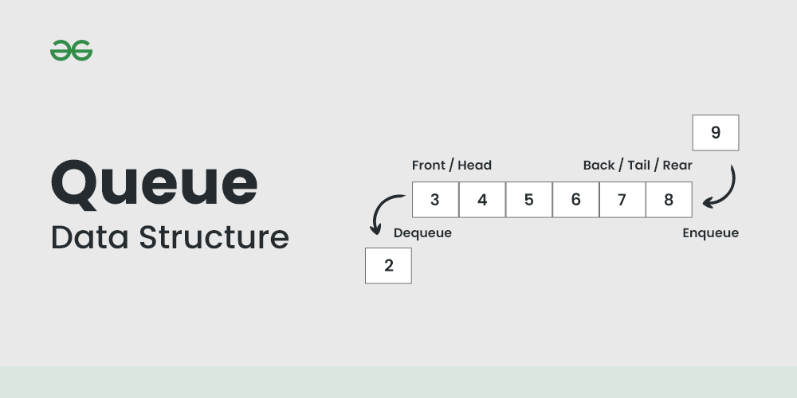
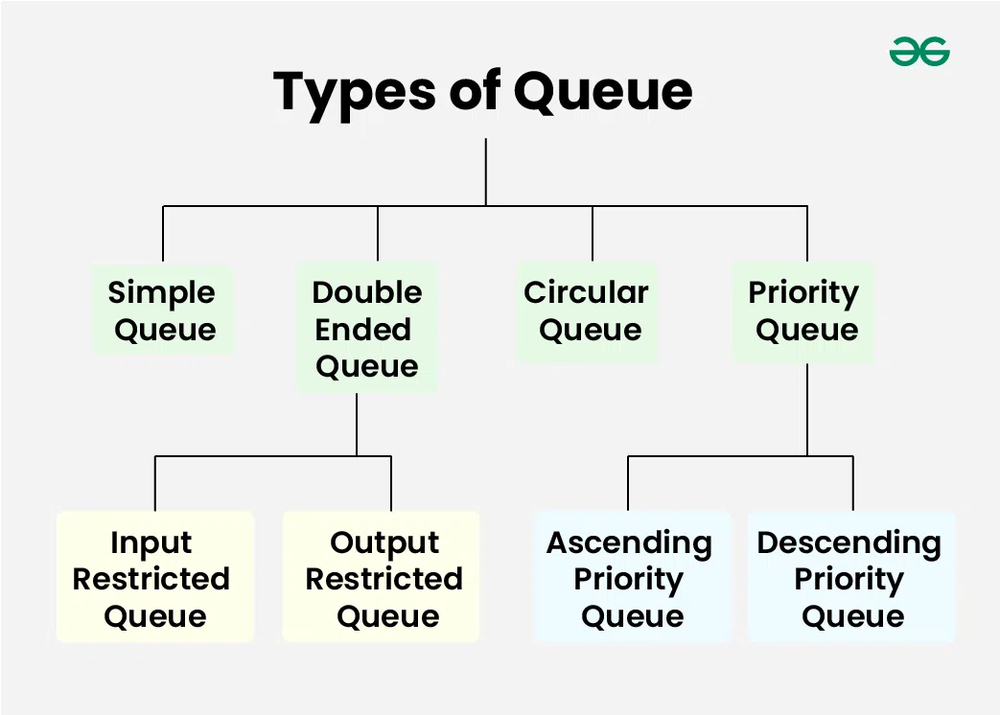

# What is Stack & Queue?

## Stack Data Structure
A Stack is a linear data structure that follows `LIFO(Last In First Out) Principle`, the last element inserted is the first to be popped out. It means both insertion and deletion operations happen at one end only.  

  

**LIFO(Last In First Out) Principle**  
A shuttlecock box is great example of LIFO principle where do insertions and removals from the same end.

### Types of Stack:
- Fixed Size Stack: A fixed size stack has a fixed size and cannot grow or shrink dynamically.    
  - If the stack is *full*, an attempt is made to add -> an **overflow** error occurs.  
  - If the stack is *empty*, an attempt is made to remove -> an **underflow** error occurs.

- Dynamic Size Stack: A dynamic size stack can grow or shrink dynamically.  
  - It automatically increases, decreases depends on input.
  - Dynamic Stack is implemented using a linked list, as it allows for easy resizing of the stack.

### Basic Operations on Stack:
- **push()** to insert an elements.  
- **pop()** to remove an element from stack.  
- **top()** returns the top element.  
- **isEmpty()** returns true if stack is empty, else false.
- **isFull()** returns true if the stack is full, else false.

***All the operations on Stack, have O(1) time and space complexity.***

---

## Queue Data Structure
Queue is a linear data structure that follows `FIFO(First In First Out)` Principle, the first element inserted is the first to be popped out.  

**FIFO Principle in Queue:**  
Queue is like a line of people waiting to purchase tickets, where the first person in line is the first person served.

### Basic Terminologies of Queue
- Front: 
  - Position of the entry in a queue ready to be served.
  - The first entry that will be removed from the queue.
  - It is also referred as the ***head*** of the queue.  
- Rear:
  - Position of the last entry in a queue.  
  - The one most recently added.  
  - It is also referred as the ***tail*** of the queue.
- Size:
  - The current number of elements in the queue.    
- Capacity:
  - The **maximum** number of elements the queue can hold.  

### Operations on Queue
1. Enqueue: adds (or stores) an element to the end of the queue.  
2. Dequeue: removes the element at the front of the queue.  
3. Peek or Front Operations: returns the element at the front end without removing it.  
4. Size Operations: returns the numbers of elements present.  
5. isEmpty Operations: returns a boolean value that indicates whether the queue is empty or not.  
6. isFull Operations: returns a boolean value that indicates whether the queue is full or not.

***All the operations on Queue, have O(1) time and space complexity.***

---

### Types of Queues

---

## Linked List vs Stack vs Queue
Stack and Queue can be implemented using a Linked List.  
The key difference is how data is accessed and managed, especially the **pointer structure**.  

Stack  
- Works with **one pointer** (typically `top`).
- Operates in LIFO order.  
- In linked list problems like *Reverse Linked List`, mimics a stack.  

Queue
- Requires **two pointers** (`head` and `tail`).  
- Operates in FIFO order.  
- Many linked list problems, like *Merge Two Sorted List* and *Odd Even Linked List*, behave like a queue.  

### Linked List as Foundation  
Linked List itself does not restrict how we process data; it depends on the logic we apply.  
But since it is sequential structure with pointer connections, its behavior often resembles a queue when traversing.  
In practice, stack/queue logic is built on top of linked list nodes with pointer rearrangement.  

### Python Implementation Note
In Python, built-in `list`, `deque` or `collections` are often used to simulate stack/queue.  
But in linked list problems (LeetCode), we directly use `ListNode` and pointer manipulation to simulate stack or queue behaviors.  
So even if it feels like a queue, what matter is **how we move pointers and access data**; that defines the behavior.

---

## Reference
- [Stack](https://origin.geeksforgeeks.org/introduction-to-stack-data-structure-and-algorithm-tutorials/)
- [Queue](https://www.geeksforgeeks.org/introduction-to-queue-data-structure-and-algorithm-tutorials/)
